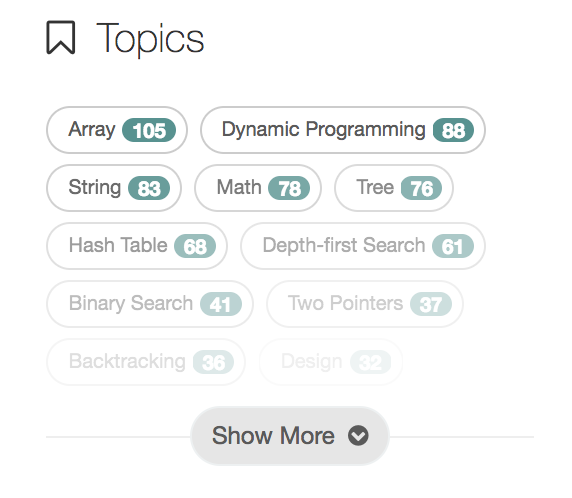

# Guide for Algorithm Practice

## Resources
1. [LeetCode Question Difficulty Distribution (only for old problems)](http://zephyrusara.blogspot.jp/2014/07/leetcode-question-difficulty.html)
2. [8 Levels suggested by interviewbit.com, also including some video tutorials.](https://www.interviewbit.com/courses/programming/)
3. [All LeetCode problems (sorted by topics on one of the right panels)](https://leetcode.com/problemset/all/)

## Suggested Strategy for LeetCode
- Crack each levels one by one following the order introduced in res. 2.
- For each level, get the LeetCode problems set from res. 3.
- And following the difficulty and frequency order described in res.1 (from easy to hard, from the most frequent to the least).
- If a problem was not evaluated in res.1, you can determine its priority by LeetCode official difficulty, as well as the description about that problem.
